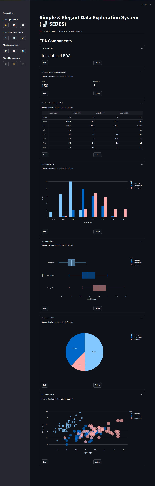
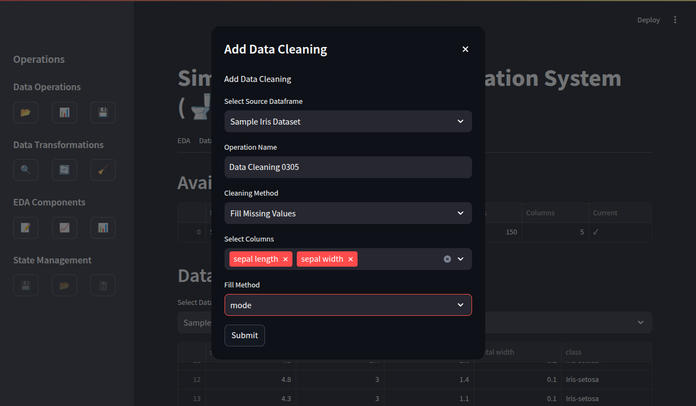
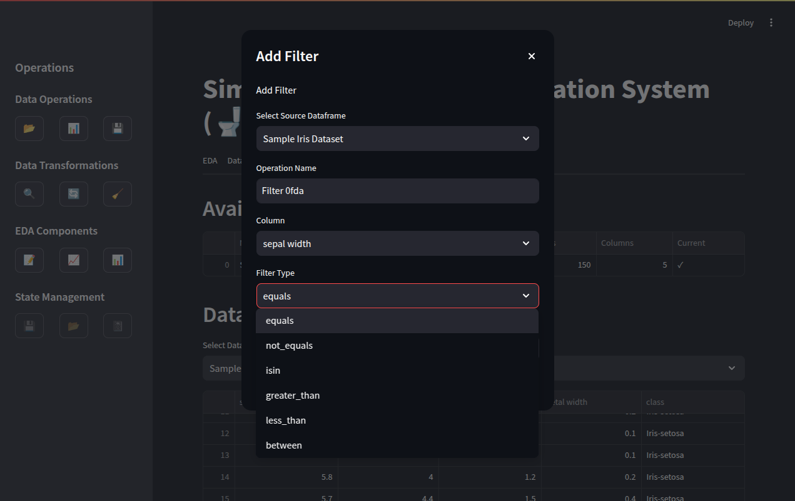
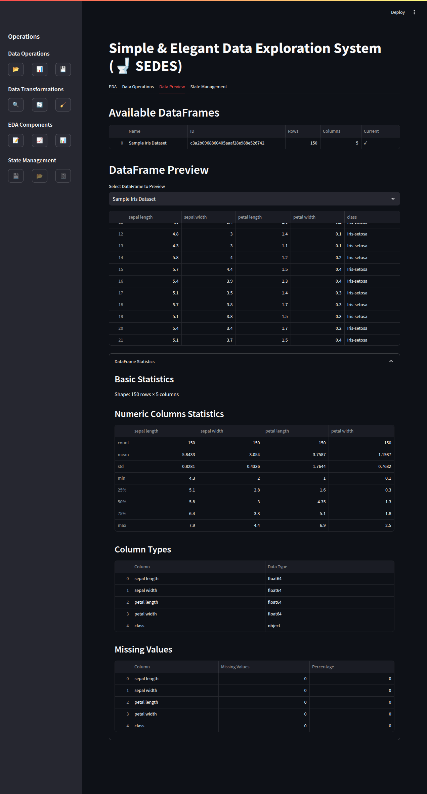

# 🚽 SEDES - Simple & Elegant Data Exploration System

SEDES is a powerful, interactive Exploratory Data Analysis (EDA) tool built with Streamlit that allows users to easily upload, transform, visualize, and analyze data without writing code.

## Features

- **Data Upload**: Import CSV files with customizable separators
- **Data Transformation**: Apply filters, aggregations, and cleaning operations
- **Dynamic Visualization**: Create and customize various chart types using Plotly Express
- **Data Info Components**: Display various types of information about your dataframes
- **State Management**: Save and load application state, generate Jupyter notebooks
- **Operation History**: Track all data operations with the ability to edit or delete them
- **Interactive UI**: User-friendly interface with modal dialogs for all operations
- **Sample Data**: Includes sample dataset to get started quickly

## Chart Types

SEDES supports a variety of chart types:
- Line Charts
- Bar Charts
- Histograms
- Scatter Charts
- Pie Charts
- Box Plots
- Violin Plots
- Heatmaps
- Area Charts
- Funnel Charts

## Data Info Components

The Data Info feature allows you to display various types of information about your dataframes:
- DataFrame Preview
- Shape (rows & columns)
- Statistics (using `describe()`)
- Column Types
- Missing Values
- All Information (combining all aspects)

## Screenshots

### EDA Tab


### Data Cleaning Operation


### Edit Filter Operation


### Data Preview Tab



## Installation

1. Clone the repository:
```bash
git clone https://github.com/yourusername/Sedes.git
cd Sedes
```

2. Install dependencies using uv:
```bash
uv sync
```

## Usage

Run the application with:
```bash
uv run streamlit run src/app.py
```

The application will open in your default web browser.

### Getting Started

1. **Load Data**: Click the "📂" button in the sidebar to load a CSV file
2. **Add Operations**: Use the sidebar buttons to add filters, aggregations, or data cleaning operations
3. **Add Components**: Create charts, text components, and data info displays in the EDA tab
4. **View Data**: Explore your data in the Data Preview tab
5. **Manage State**: Save your work, load previous sessions, or generate Jupyter notebooks

## Project Structure

- `src/app.py`: Main application file with UI components and logic
- `src/state.py`: Application state management
- `src/components.py`: UI component definitions
- `src/charts.py`: Chart creation and customization
- `src/df_operations.py`: Data operations (filter, aggregate, clean)
- `src/dfinfo.py`: DataFrame information utilities
- `src/codegen.py`: Code generation for Jupyter notebooks

## License

[MIT License](LICENSE)


## Acknowledgments

- Built with [Streamlit](https://streamlit.io/)
- Visualizations powered by [Plotly Express](https://plotly.com/python/plotly-express/)
- Data manipulation with [Pandas](https://pandas.pydata.org/)